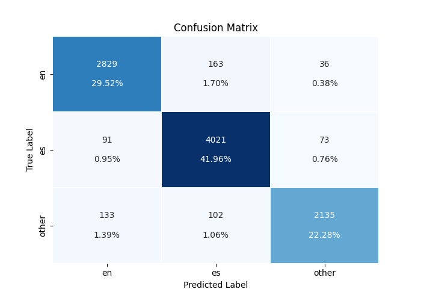

# MultiLingual-Code-Switching

## Task Description
Currently, the research in NLP has been focusing on dealing with types of multilingual content. Thus, the first thing that we need to learn for working on different NLP tasks, such as Question Answering, is to identify the languages accurately on texts. 
## Data


This data is a collection of tweets; in particular, for the training set and for the validation set:


* `tweets.tsv`:
```
tweet_id, user_id, tweet text
```

```

The gold labels can be one of three:

* en
* es
* other

```


## Data Analysis
- The data distribution in both the training and test sets is imbalanced. In the training data, `English` tokens make up about 50%, whereas in the test set, `Spanish` tokens dominate.

    | Label    | Train   | Dev  |
    |----------|---------|------|
    | `en`     | **46042** | 3028 |
    | `es`     | 25563  | **4185** |
    | `other`  | 20257  | 2370 |
    | **Sum**  | 91862  | 9583 |

- The training set contains `7400` tweets, while the test set has `832` tweets. These tweets come from two distinct user groups. The training set includes tweets from 6 individuals, and the test set includes tweets from 8 individuals.

    | User ID  | Train       | Dev        |
    |----------|-------------|------------|
    | 1        | 1160520883  | 156036283  |
    | 2        | 1520815188  | 21327323   |
    | 3        | 1651154684  | 270181505  |
    | 4        | 169403434   | 28261811   |
    | 5        | 304724626   | 364263613  |
    | 6        | 336199483   | 382890691  |
    | 7        |             | 418322879  |
    | 8        |             | 76523773   |

- Distribution of unique tokens and characters:

    |          | Unique Tokens | Unique Tokens (Lowercase) | Unique Characters |
    |----------|---------------|---------------------------|--------------------|
    | Train    | 14366         | 12220                    | 50                |
    | Dev      | 2771          | 2559                     | 28                |

- The distribution of the length of tokens, generated with the following one-liner in Linux:

    ```bash
    cut -f5 train_data.tsv | awk '{print length}' | sort -n | uniq -c | awk -F" " '{print $NF " " $(NF-1)}' | R --slave -e 'x <- scan(file="stdin", quiet=TRUE, what=list(numeric(), numeric())); png("Histogram of tokens length-train.png"); plot(x[[1]], x[[2]], xlab="length", ylab="frequency", main="Train");'
    ```

    
    

    - The token length distribution is similar across both datasets, with slight shifts. Outliers exist due to repeated characters in social media. The weighted average token lengths for the training and test sets are `3.93` and `4.11`, respectively. The following command was used to compute these values:

    ```bash
    cut -f5 train_data.tsv | awk '{print length}' | sort -n | uniq -c | awk -F" " '{print $NF " " $(NF-1)}' | tr " " "*" | paste -sd+ | bc -l
    ```

### Preprocessing

- Some rows in `[train|dev]_data.csv` include `"` characters, causing issues with `pandas.read_csv`. To handle this, set the `quotechar` to `'\0'` (NULL) in `pandas.read_csv`.
- To check for null values, use:

    ```bash
    grep -Pa '\x00' data/train_data.tsv
    grep -Pa '\x00' data/dev_data.tsv
    ```

- Alternatively, use the `quoting` option with value `3` (`QUOTE_NONE`) to address this issue.
- To handle long, repetitive character sequences, limit repetitions to five and restrict each token’s length to 20 characters:

    ```python
    df['token'] = df['token'].apply(lambda t: re.sub(r'(.)\1{4,}', r'\1\1\1\1', t)[:20])
    ```

```
#### Model Summary
```bash
=================================================================
Layer (type:depth-idx)                   Param #
=================================================================
├─Char2Vec: 1-1                          --
|    └─Embedding: 2-1                    2,700
|    └─Sequential: 2-2                   --
|    |    └─Conv1d: 3-1                  588
|    |    └─ReLU: 3-2                    --
|    |    └─Dropout: 3-3                 --
|    └─ModuleList: 2-3                   --
|    |    └─Sequential: 3-4              320
|    |    └─Sequential: 3-5              425
|    |    └─Sequential: 3-6              530
|    └─Sequential: 2-4                   --
|    |    └─Linear: 3-7                  240
|    |    └─ReLU: 3-8                    --
├─LSTM: 1-2                              543,744
├─Linear: 1-3                            1,028
=================================================================
Total params: 549,575
Trainable params: 549,575
Non-trainable params: 0
=================================================================
```

## How to use the code

### Training

Just run `train.py` from `code` directory. It assumes that the `cwd` is in the `code` directory.

### Prediction

Launch `predict.py` with the following arguments:

- `model`: path of the pre-trained model
- `text`: input text

Example usage:
```bash
python predict.py --model pretrained_model.pth --text="@lililium This is an audio book !"
```

# Result

 Running the model on the Google Colab with `Tesla T4 GPU` and 100 epochs, achieved the `validation f1-score` of `0.92`.

 

### classification Report

```bash
              precision    recall  f1-score   support

          en       0.93      0.93      0.93      3028
          es       0.94      0.96      0.95      4185
       other       0.95      0.90      0.93      2370

    accuracy                           0.94      9583
   macro avg       0.94      0.93      0.94      9583
weighted avg       0.94      0.94      0.94      9583
```

### Confusion Matrix


## TODO
 - [ ] Data augmentation
 - [ ] Fine tunning the model to find the best hyper-parameters
